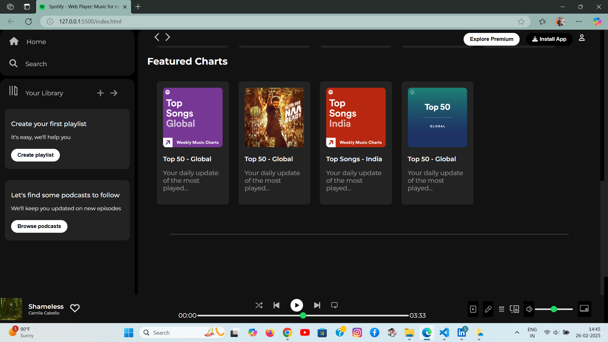

# SPOTIFY CLONE

## Description
A simple music streaming platform using HTML and CSS.

## DEMO

## Installation
- Clone the repository: git clone [https://github.com/your-username/your-repository.git](https://github.com/your-username/your-repository.git)
- Open the project folder: cd your-repository
- Open the HTML file in your browser.

# Usage
To use this Spotify Clone, simply open the index.html file in a web browser after cloning the repository to your local machine. Once loaded, you'll be greeted with a user interface resembling the Spotify web player. Navigate through the different sections using the sidebar, explore featured charts, and control music playback with the player controls. The clone offers a glimpse into Spotify's design and functionality, providing a familiar environment for users to enjoy and interact with. Customize playlists, explore trending songs, and experience a simplified version of the Spotify music streaming experience right in your web browser.

You can also watch the demo website here: [https//spiffy-custard-253ce9.netlify.app/](https//spiffy-custard-253ce9.netlify.app/)

